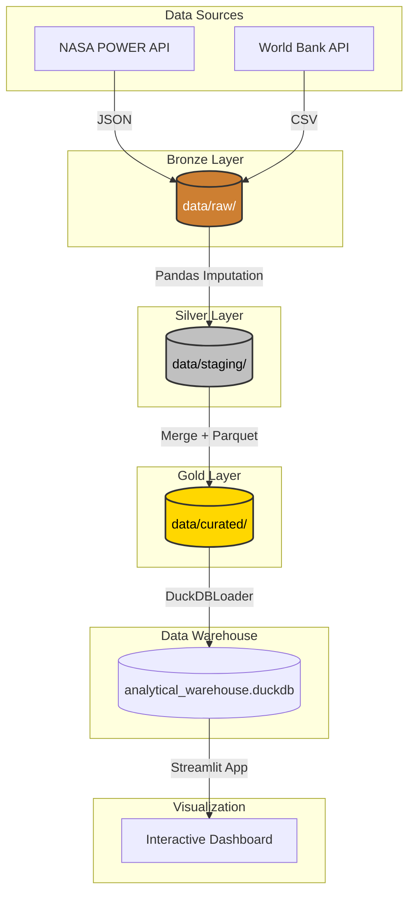

# 🌍 Portugal Data Insights: Climate & Economy Pipeline

A complete Data Engineering pipeline utilizing the Medallion Architecture to transform fragmented meteorological and macroeconomic APIs into a high-performance analytical Data Warehouse, culminating in an interactive socio-economic dashboard.

The system combines automated API extraction, resilient error handling, data imputation, columnar storage, and OLAP database modeling to convert raw historical data into actionable visualizations — entirely local and highly performant.

---

# 🚀 Pipeline Overview

The workflow is divided into four sequential stages:

```text
Raw API Telemetry (NASA & World Bank)
        ↓
Bronze Layer (Raw Extraction & Persistence)
        ↓
Silver Layer (Cleansing & Imputation)
        ↓
Gold Layer (Integration & Feature Engineering)
        ↓
Data Warehouse (DuckDB Loading)
        ↓
Interactive Dashboard (Visual Analytics)
```

---

# 🧩 Architecture

## 1. Bronze Layer: Extraction (src/extract/)

Reconstructs the raw state of the world from disparate sources.

The extraction engine:

- Connects to NASA POWER API using geographical centroids
- Extracts macroeconomic indicators via World Bank APIs
- Implements Exponential Backoff for API rate-limit resilience
- Persists data immutably in native formats (JSON/CSV)
- Operates in isolated subprocesses for execution safety

---

## 2. Silver Layer: Transformation (src/transform/)

Computes operational baselines and cleanses structural noise.

Generated transformations include:

- Null value imputation using forward/backward fill strategies
- Schema normalization and strict data typing
- Time-series alignment
- Erroneous outlier removal
- Standardization of column nomenclatures

---

## 3. Gold Layer: Integration (src/transform/gold_merger.py)

Transforms isolated metrics into an analytical One Big Table (OBT).

The integration engine:

- Merges climatic and economic datasets using Temporal Keys (Year)
- Computes derived business metrics (e.g., Amplitude_Termica)
- Compresses output into highly optimized .parquet columnar format
- Ensures 100% referential integrity across the 2000-2023 timeframe

---

## 4. Analytical Data Warehouse (src/load/duckdb_loader.py)

Loads the curated data into an embedded OLAP engine.

The database layer:

- Auto-generates the database schema dynamically
- Ingests Parquet files with zero-copy architecture
- Enforces data integrity using UNIQUE INDEX constraints
- Provides sub-second aggregation speeds for downstream BI tools

---

## 5. Visual Intelligence (app.py)

Compiles generated metrics into a reactive, user-friendly interface.

The Streamlit dashboard includes:

- Dynamic KPI cards with temporal deltas
- Dual-axis correlation plotting
- Interactive multi-tab navigation
- Real-time Correlation Matrix generation
- Dynamic slicing via temporal sliders

---

# 📈 Data Flow Pipeline

```text
nasa_api / world_bank_api
    ↓
NasaPowerExtractor / WorldBankExtractor
    ↓
data/raw/ (JSON & CSV)
    ↓
NasaPowerTransformer / WorldBankTransformer
    ↓
data/staging/ (Cleaned CSV / parquet)
    ↓
GoldMerger
    ↓
data/curated/ (Optimized Parquet)
    ↓
DuckDBLoader
    ↓
data/database/analytical_warehouse.duckdb
```

---

# 🗺️ Architectural Diagram



---

# ⚡ Performance

The ETL engine was designed with portability and analytical speed in mind.

Key optimizations include:

- Subprocess isolation to prevent memory leaks
- Columnar data storage (Apache Parquet) reducing disk I/O
- In-process OLAP querying (DuckDB) eliminating server latency
- Native Streamlit caching decorators to avoid database fatigue

The complete pipeline is designed to execute and build the database within:

```text
< 60 seconds on a standard machine
```

---

# 🛠️ Requirements

-Python 3.10+

Install dependencies:

```Bash
pip install -r requirements.txt
```

---

# 📦 requirements.txt

```text
requests
pandas
pyarrow
duckdb
streamlit
plotly
harlequin
```

---

# 📁 Project Structure

```text
project/
│
├── data/
│   ├── raw/             # Bronze Layer outputs
│   ├── staging/         # Silver Layer outputs
│   ├── curated/         # Gold Layer outputs
│   └── database/        # DuckDB persistent storage
│
├── src/
│   ├── extract/         # API Connectors
│   ├── transform/       # Cleansing & Merging scripts
│   └── load/            # Data Warehouse ingestion
│
├── main.py              # ETL Orchestrator
├── app.py               # Streamlit Dashboard
├── requirements.txt
└── README.md
```

---

# ⚙️ Usage

## 1. Execute the Full ETL Pipeline

Extracts data, cleans it, merges it, and builds the analytical database entirely offline.

```Bash
python main.py
```

## 2. Launch the Analytics Dashboard

Spins up the local web server to interact with the visualizations.

```Bash
streamlit run app.py
```

## 3. Direct SQL Exploration (Optional)

Use Harlequin to run native SQL queries directly against the Data Warehouse from the terminal.

```Bash
harlequin data/database/analytical_warehouse.duckdb
```

---

# 🔒 Validation & Reliability

The pipeline includes several validation layers to ensure consistency and reliability.

## API Validation

-Exponential backoff strategies prevent silent failures during external data fetches
-HTTP status code validation before data persistence

## Data Integrity Validation

- Schema enforcement during Silver phase
- Type casting prior to Parquet compression
- Null value tracking and strategic imputation

## Database Constraints

- UNIQUE INDEX enforcement on the Year column
- Prevention of duplicate row ingestion
- Automated table dropping and rebuilding during orchestrated runs

---

# 📊 Example Workflow

```text
2 Distinct External APIs
        ↓
Raw JSON/CSV ingestion
        ↓
Pandas data normalization
        ↓
24 Unique Socio-economic & Climatic metrics
        ↓
1 Consolidated OBT (One Big Table)
        ↓
Interactive correlation mapping
```

---

# 📖 Data Dictionary (Gold Layer - `gold_metrics_pt`)

This dictionary specifies the structure, origin, and transformation rules applied to the denormalized One Big Table (OBT) contained within the Data Warehouse.

| Field Name | Description | Type | Source | Transformation Rule / Notes |
| :--- | :--- | :--- | :--- | :--- |
| `Ano` | Fiscal and metric record year (2000-2023) | `INTEGER` | Both | **Temporal Primary Key**. Used for index alignment (Merge). |
| `Codigo_Pais` | Two-letter ISO country code | `VARCHAR` | Both | Static normalized value (`PT`). |
| `T2M_Media_Anual` | Annual mean of daily temperature at 2 meters | `FLOAT` | NASA POWER | Mathematical aggregation (`mean`) on raw daily data in the Silver layer. |
| `T2M_Maxima_Anual` | Absolute maximum temperature recorded in the year | `FLOAT` | NASA POWER | Absolute maximum value extraction (`max`) in the Silver layer. |
| `T2M_Minima_Anual` | Absolute minimum temperature recorded in the year | `FLOAT` | NASA POWER | Absolute minimum value extraction (`min`) in the Silver layer. |
| `Amplitude_Termica` | Annual difference between maximum and minimum temperature | `FLOAT` | Derived Metric | **Feature Engineering (Gold):** Calculated via `T2M_Maxima_Anual - T2M_Minima_Anual`. |
| `Acesso_a_Eletricidade(% populacao)` | Percentage of population with access to electricity | `FLOAT` | World Bank | Integrity treatment: Forward and Backward Fill applied for nulls. |
| `Area_Florestal(% do total)` | Forest area percentage relative to total land area | `FLOAT` | World Bank | Scale alignment and missing record imputation. |
| `CO2_per_capita` | CO2 emissions in metric tons per capita | `FLOAT` | World Bank | Crucial metric for environmental impact analysis. |
| `CO2_produced_per_unit_of_GDP` | CO2 emissions per unit of GDP generated | `FLOAT` | World Bank | Direct temporal alignment in the Silver layer. |
| `Consumo_de_Energia_Renovavel(% do total)` | Renewable energy percentage of total final energy consumption | `FLOAT` | World Bank | Used in the Dashboard's Environmental tab. |
| `Crescimento_PIB` | Annual percentage growth rate of GDP | `FLOAT` | World Bank | Direct percentage value indexed to the fiscal year. |
| `Desemprego(% trabalhadores)` | Percentage of the total labor force that is unemployed | `FLOAT` | World Bank | Modeled estimate by the International Labour Organization (ILO). |
| `Esperança_de_Vida` | Life expectancy at birth in years | `FLOAT` | World Bank | Missing data imputed in the Silver layer via historical temporal proximity. |
| `Gastos_com_Educacao(% PIB)` | Public current expenditure on education as % of GDP | `FLOAT` | World Bank | Used to calculate bubble weight in the social scatter plot. |
| `Gastos_com_Saude_per_capita(US$)` | Current health expenditure per capita in USD | `FLOAT` | World Bank | Financial indexing in USD to maintain currency consistency. |
| `Inflação(% anual)` | Annual variation of the consumer price index | `FLOAT` | World Bank | Macroeconomic indicator of market stability. |
| `PIB_per_capita` | Gross Domestic Product divided by total population | `FLOAT` | World Bank | Constant USD values. Primary economic growth metric. |
| `Populacao` | Total resident population | `BIGINT` | World Bank | Converted to big integer to support absolute population volumes. |
| `Producao_de_Energia_Renovavel(% do total)` | Electricity generated from renewable sources over total | `FLOAT` | World Bank | Structural cleaning and alignment in the Silver layer. |
| `Utilizadores_de_Internet(% populacao)` | Percentage of individuals using the internet | `FLOAT` | World Bank | Digital penetration rate used in social data crossing. |

---

# 🤖 AI Usage Log

In compliance with the course's integrity and transparency requirements, this section logs the utilization of Large Language Models (LLMs) as engineering assistants throughout the project's lifecycle.

### 🎯 Requirements and Spec-Driven Approach

* **Architecture Design:** Modeling based on the Medallion architecture. AI assisted in defining the isolation boundaries of the scripts (Bronze, Silver, and Gold layers) and selecting DuckDB as the OLAP engine.
* **Code Refactoring:** Generation of robust control structures (`try/except`), parameterization of extraction classes, and support in fixing type conflicts (case-sensitivity) during Pandas DataFrame reading.
* **Visual Narrative:** Assistance in mapping the logic of dual-axis subplots in Plotly to prevent scale distortions in Streamlit.

### 🧪 Human-in-the-Loop Validation

All code suggested by AI assistants underwent a rigorous validation process executed by the group:

1. Manual verification of data referential integrity through direct terminal queries using `harlequin`.
2. Pipeline stress testing by simulating network failures in APIs to validate exception routines.
3. Fine-tuning of layouts, typography, and color palettes (Dark Mode) in the user interface.

---

# 🎯 Project Goals

This project demonstrates how modern Data Engineering can bridge the gap between:

- Raw, disjointed public API telemetry
- Robust Medallion Architecture (Data Lakes)
- High-speed OLAP Data Warehouses
- Human-readable business intelligence

while maintaining:

- scalability
- explainability
- reproducibility
- full local execution

The project was developed as a practical demonstration of ETL pipelines and data visualization for the Artificial Intelligence and Data Science degree.

---

# 📄 License

MIT License